# pyochain ⛓️

**_Functional-style method chaining for Python data structures._**

`pyochain` brings a fluent, declarative API inspired by Rust's `Iterator`, `Result`, `Option`, and DataFrame libraries like Polars to your everyday Python iterables and dictionaries.

Manipulate data through composable chains of operations and manage errors and optional values safely, all while enjoying type-safe guarantees.

## Installation

```bash
uv add pyochain
```

## Overview

Pyochain focus on providing a set of core classes to work with collections, handle optional values, or manage errors.

### Collections & Iterators

The following table summarizes the main collection types provided by pyochain, along with their characteristics and Python equivalents.
All collection types can be created from any object implementing the `Iterable` protocol (think anything you can use in a `for` loop).

| Type        | Underlying Structure | Implement         | Ordered   | Uniqueness | Mutability | Python Equivalent |
| ----------- | -------------------- | ----------------- | --------- | ---------- | ---------- | ----------------- |
| `Iter[T]`   | `iterator`           | `Iterator`        | N/A       | N/A        | N/A        | `Iterator[T]`     |
| `Seq[T]`    | `tuple`              | `Sequence`        | Yes       | No         | No         | `tuple[T]`        |
| `Vec[T]`    | `list`               | `MutableSequence` | Yes       | No         | Yes        | `list[T]`         |
| `Set[T]`    | `frozenset`          | `Set`             | No        | Yes        | No         | `frozenset[T]`    |
| `SetMut[T]` | `set`                | `MutableSet`      | No        | Yes        | Yes        | `set[T]`          |
| `Dict[K,V]` | `dict`               | `MutableMapping`  | Yes       | Keys       | Yes        | `dict[K, V]`      |

### Option & Result Types

The following table summarizes the `Option` and `Result` types provided by pyochain, along with their characteristics and Python equivalents.
Due to type inference limitations in Python, small functions with explicit `Result[T, E]` or `Option[T]` return types are the recommended way to create those types.
Note that `Option` is easier to infer from context than `Result`, and can henceforth be created with simple lambdas most of the time.

| Type           | Description                             | Creation                                                          | Python Equivalent |
| -------------- | --------------------------------------- | ----------------------------------------------------------------- | ----------------- |
| `Option[T]`    | Optional value container (abstract)     | `Option.from_(value)` or if/else statements                       | `T \| None`       |
| `Some[T]`      | Represents a present value              | `Some(value)` with if/else or `Option.from_(value)`               | `T`               |
| `NONE`         | Represents absence of value             | `NONE` (singleton) with if/else or `Option.from_(None)`           | `None`            |
| `Result[T, E]` | Success or failure container (abstract) | In functions with try/except pattern                              | `T \| E`          |
| `Ok[T]`        | Represents a successful result          | `Ok(value)` in try block or success path                          | `T`               |
| `Err[E]`       | Represents a failed result              | `Err(error)` in except block or error path                        | `Exception`       |

### Graphical Overview

Below is a graphical representation of the core classes and their relationships.

```mermaid
---
config:
  look: neo
---
flowchart BT
 subgraph Collections["📦 Collections"]
    direction TB
        Seq["<b>Seq[T]</b><br>tuple"]
        Vec["<b>Vec[T]</b><br>list"]
        Set["<b>Set[T]</b><br>frozenset"]
        SetMut["<b>SetMut[T]</b><br>set"]
        Dict["<b>Dict[K,V]</b><br>dict"]
  end
 subgraph OptionGroup["🎁 Option Types"]
    direction TB
        Option["<b>Option[T]</b><br>(abstract)"]
        Some["<b>Some[T]</b><br>(has value)"]
        NONE["<b>NONE</b><br>(no value)"]
  end
 subgraph ResultGroup["✅ Result Types"]
    direction TB
        Result["<b>Result[T,E]</b><br>(abstract)"]
        Ok["<b>Ok[T]</b><br>(success)"]
        Err["<b>Err[E]</b><br>(error)"]
  end
    Option -.-> Some & NONE
    Result -.-> Ok & Err
    Collections L_Collections_IterMethod_0@--> IterMethod["⛓️<br><b>.iter()</b>"] & Into["🔄<br><b>.into(func/type)</b>"]
    OptionGroup L_OptionGroup_IterMethod_0@--> IterMethod & OkOrMethod["✅<br><b>.ok_or(err)</b>"] & Into
    ResultGroup L_ResultGroup_IterMethod_0@--> IterMethod & OkMethod["🎁<br><b>.ok()</b>"] & Into
    IterMethod L_IterMethod_Iter_0@--> Iter["<b>Iter[T]</b><br>lazy iterator"]
    Iter L_Iter_CollectMethod_0@--> CollectMethod["📦<br><b>.collect(func/type)</b>"] & Into
    CollectMethod L_CollectMethod_Collections_0@--> Collections
    OkOrMethod L_OkOrMethod_ResultGroup_0@--> ResultGroup
    OkMethod L_OkMethod_OptionGroup_0@--> OptionGroup
    Into L_Into_AnyType_0@--> AnyType["🔄 Any Type"]

    IterMethod@{ shape: rounded}
    Into@{ shape: rounded}
    OkOrMethod@{ shape: rounded}
    OkMethod@{ shape: rounded}
    CollectMethod@{ shape: rounded}
     Seq:::collectionsStyle
     Vec:::collectionsStyle
     Set:::collectionsStyle
     SetMut:::collectionsStyle
     Dict:::collectionsStyle
     Option:::optionStyle
     Some:::optionStyle
     NONE:::optionStyle
     Result:::resultStyle
     Ok:::resultStyle
     Err:::resultStyle
     IterMethod:::iterMethodStyle
     Into:::intoStyle
     OkOrMethod:::okOrMethodStyle
     OkMethod:::okMethodStyle
     Iter:::iterStyle
     CollectMethod:::collectMethodStyle
     AnyType:::anyStyle
    classDef collectionsStyle fill:#e3f2fd,stroke:#1976d2,stroke-width:3px,color:#000
    classDef iterMethodStyle fill:#c8e6c9,stroke:#2e7d32,stroke-width:3px,color:#000
    classDef iterStyle fill:#e8f5e9,stroke:#388e3c,stroke-width:3px,color:#000
    classDef collectMethodStyle fill:#b3e5fc,stroke:#0277bd,stroke-width:3px,color:#000
    classDef okOrMethodStyle fill:#ffccbc,stroke:#d84315,stroke-width:3px,color:#000
    classDef okMethodStyle fill:#fff59d,stroke:#f9a825,stroke-width:3px,color:#000
    classDef optionStyle fill:#fff9c4,stroke:#f57f17,stroke-width:3px,color:#000
    classDef resultStyle fill:#ffebee,stroke:#c62828,stroke-width:3px,color:#000
    classDef intoStyle fill:#e1bee7,stroke:#7b1fa2,stroke-width:3px,color:#000
    classDef anyStyle fill:#f5f5f5,stroke:#616161,stroke-width:2px,stroke-dasharray:5,color:#000
    style IterMethod fill:#FFD600,stroke:#FF6D00
    style Into stroke:#FF6D00,fill:#FFD600
    style OkOrMethod fill:#FFD600,stroke:#FF6D00
    style OkMethod fill:#FFD600,stroke:#FF6D00
    style CollectMethod fill:#FFD600,stroke:#FF6D00
    style AnyType stroke-width:1px,stroke-dasharray: 0
```



### Shared Core Features

All provided classes share the following core methods for enhanced usability:

- **`.inspect()`**: Insert functions who compute side-effects in the chain without breaking it (print, mutation of an external variable, logging...). If Option or Result, call the function only if `Some` or `Ok`.

- **`.into()`**:  Take a `Callable[[Self, P], T]` as argument to convert from **Self** to **T** in a chained way.

E.g `Seq[T].into()` can take any function/object that expect a `Sequence[T]` as argument, and return it's result `R`.
Conceptually, replace`f(x, args, kwargs)` with `x.into(f, args, kwargs)`.
Note that `Iter.collect()` is just a specific case of `into()`, with constraint on the return type being one of the collection types (but the implementation is the same), and `Seq` as a default argument value.
Using `collect()` for `Iter` rather than `into()` is considered the idiomatic way to materialize data from an iterator in pyochain.  

## API Reference 📖

The full API reference can be found at:
<https://outsquarecapital.github.io/pyochain/>

## Notice on Stability ⚠️

`pyochain` is currently in early development (< 1.0), and the API may undergo significant changes multiple times before reaching a stable 1.0 release.

### Examples

#### Chained Data Transformations

```python
>>> import pyochain as pc
>>>
>>> result = (
...    pc.Iter.from_count(1)  # Infinite iterator: 1, 2, 3, ...
...    .filter(lambda x: x % 2 != 0)  # Keep odd numbers
...    .map(lambda x: x * x)  # Square them
...    .take(5)  # Take the first 5
...    .collect()  # Materialize the result into a Seq
... )
>>> result
Seq(1, 9, 25, 49, 81)

```

#### Type-Safe Error Handling (`Result` and `Option`)

Write robust code by handling potential failures explicitly.

```python
>>> import pyochain as pc
>>>
>>> def divide(a: int, b: int) -> pc.Result[float, str]:
...     if b == 0:
...         return pc.Err("Cannot divide by zero")
...     return pc.Ok(a / b)
>>>
>>> # --- With Result ---
>>> res1 = divide(10, 2)
>>> res1
Ok(5.0)
>>> res2 = divide(10, 0)
>>> res2
Err('Cannot divide by zero')
>>> # Safely unwrap or provide a default
>>> res2.unwrap_or(0.0)
0.0
>>> # Map over a successful result
>>> res1.map(lambda x: x * x)
Ok(25.0)
>>> # --- With Option ---
>>> def find_user(user_id: int) -> pc.Option[str]:
...     users = {1: "Alice", 2: "Bob"}
...     return pc.Some(users.get(user_id)) if user_id in users else pc.NONE
>>>
>>> find_user(1).map(str.upper).unwrap_or("Not Found")
'ALICE'
>>> find_user(3).unwrap_or("Not Found")
'Not Found'

```

Find more examples in the [examples file](EXAMPLES.md).

### Philosophy

- **Declarative over Imperative:** Replace explicit `for` and `while` loops with sequences of high-level operations (map, filter, group, join...).
- **Fluent Chaining:** Most methods transforms the data and returns a new wrapper instance, allowing for seamless chaining.
- **Lazy first:** All methods on collections that use an Iterator (think most for loop) and do not need to materialize data immediately are in `Iter[T]`.
Only methods that directly returns booleans, single values, or need to operate on the whole dataset (sorting for example) are shared between the `Iterable` classes (`Seq`, `Vec`, `Set`, `SetMut`) via their common base class.
This encourages the use of lazy processing by default (since you have to explicitly call `iter()` to get access to most methods), and collecting only at the last possible moment.
- **Explicit mutability:** `Seq` is the usual return type for most methods who materialize data, hence improving memory efficiency and safety, compared to using list everytime. `Vec` is provided when mutability is required. Same for `Set` and `SetMut`. In python, set is the "default" set type (constructor and shorter name), but in pyochain Set is a frozenset.
- **100% Type-safe:** Extensive use of generics and overloads ensures type safety and improves developer experience. The library is fully typed and autocompletion is a central concern.
- **Documentation-first:** Each method is thoroughly documented with clear explanations, and usage examples. Before any commit is made, each docstring is automatically tested to ensure accuracy. This also allows for a convenient experience in IDEs, where developers can easily access documentation with a simple hover of the mouse, with a guarantee that the examples work as intended.
- **Functional and chained paradigm:** Design encourages building complex data transformations by composing simple, reusable functions on known buildings blocks, rather than implementing customs classes each time.

### Inspirations

- **Rust's language and  Rust stdlib:** Emulate naming conventions (`into()`) and leverage concepts from Rust's powerful iterator traits (method chaining, lazy evaluation), Option and Result enums, to bring similar expressiveness to Python.
- **Python iterators libraries:** Libraries like `cytoolz`, and `more-itertools` provided ideas, inspiration, and implementations for many of the iterator methods.
- **PyFunctional:** Although not directly used (because I started writing pyochain before discovering it), also shares similar goals and ideas.

## Key Dependencies and credits

Most of the computations are done with implementations from the `cytoolz` and `more-itertools` libraries.

An extensive use of the `itertools` stdlib module is also to be noted.

pyochain acts as a unifying API layer over these powerful tools.

<https://github.com/pytoolz/cytoolz>

<https://github.com/more-itertools/more-itertools>

The stubs used for the developpement, made by the maintainer of pyochain, can be found here:

<https://github.com/OutSquareCapital/cytoolz-stubs>
