# Types Overview

Pyochain provides a comprehensive set of abstract base classes and concrete collection types, inspired by Python's `collections.abc` module and Rust's iterator patterns.

## Core Traits

Pyochain's type system is built on two categories of traits:

1. **Fluent traits (mixins)** — providing methods for fluent method chaining and conversion to `Option` and `Result` types
2. **Abstract collection traits** — mirroring Python's `collections.abc` hierarchy to ensure protocol compatibility

For concrete examples of these traits in action, see the [interoperability section](interoperability.md).

### Fluent Traits (Mixins)

Fluent traits are mixins that can be added to any class to enable functional method composition. They depend only on `Self` for their implementation, making them universally applicable.

| Trait | Purpose | Main Capabilities | Inherited by |
| --- | --- | --- | --- |
| `Pipeable` | Functional chaining | `into()`, `inspect()` for fluent method composition | All pyochain objects |
| `Checkable` | Conditional operations | `then()`, `ok_or()`, `err_or()` for wrapping in `Option`/`Result` | All pyochain iterables + `Option` + `Result` |

### Abstract Collection Traits

Abstract collection traits form a hierarchy that mirrors Python's `collections.abc` module. Each trait extends a specific protocol from `collections.abc`, inheriting its interface while adding pyochain-specific functionality through fluent traits.

Concrete types must implement the required methods (dunders) to satisfy the protocol contract.

| Trait | Extends | Inherits from `collections.abc` | Required Methods (for concrete types) | Concrete Types |
| --- | --- | --- | --- | --- |
| `PyoIterable[T]` | `Pipeable`, `Checkable` | `Iterable[T]` | `__iter__` | All pyochain collections |
| `PyoIterator[T]` | `PyoIterable[T]` | `Iterator[T]` | `__iter__`, `__next__` | `Iter[T]` |
| `PyoCollection[T]` | `PyoIterable[T]` | `Collection[T]` | `__contains__`, `__iter__`, `__len__` | All eager collections |
| `PyoSequence[T]` | `PyoCollection[T]` | `Sequence[T]` | `__getitem__`, `__len__` | `Seq[T]` |
| `PyoMutableSequence[T]` | `PyoSequence[T]` | `MutableSequence[T]` | `__setitem__`, `__delitem__`, `insert` | `Vec[T]` |
| `PyoSet[T]` | `PyoCollection[T]` | `Set[T]` | `__contains__`, `__iter__`, `__len__` | `Set[T]`, `PyoKeysView[K]`, `PyoItemsView[K,V]` |
| `PyoMutableSet[T]` | `PyoSet[T]` | `MutableSet[T]` | `add`, `discard` | `SetMut[T]` |
| `PyoMappingView[T]` | `PyoCollection[T]` | `MappingView` | `__len__` | All mapping views |
| `PyoMapping[K, V]` | `PyoCollection[K]` | `Mapping[K, V]` | `__getitem__`, `__iter__`, `__len__` | `Dict[K,V]` (read-only interface) |
| `PyoMutableMapping[K, V]` | `PyoMapping[K, V]` | `MutableMapping[K, V]` | `__setitem__`, `__delitem__` | `Dict[K,V]` |

## Concrete Collections & Iterators

Pyochain provides concrete collection types that implement the abstract traits described above. All collections can be created from any object implementing Python's `Iterable` protocol.

Since these types fully implement their corresponding `collections.abc` protocols by providing all required dunder methods, they can act as drop-in replacements for their Python standard library counterparts.

### Concrete Collection Types

| Type                | Underlying Structure | Implements `collections.abc`        | Ordered | Uniqueness | Mutability |
|---------------------|----------------------|-------------------------------------|---------|------------|------------|
| `Iter[T]`           | `Iterator[T]`        | `Iterator[T]`                       | N/A     | N/A        | N/A        |
| `Seq[T]`            | `tuple[T]`           | `Sequence[T]`                       | Yes     | No         | No         |
| `Vec[T]`            | `list[T]`            | `MutableSequence[T]`                | Yes     | No         | Yes        |
| `Set[T]`            | `frozenset[T]`       | `Set[T]`                            | No      | Yes        | No         |
| `SetMut[T]`         | `set[T]`             | `MutableSet[T]`                     | No      | Yes        | Yes        |
| `Dict[K,V]`         | `dict[K, V]`         | `MutableMapping[K, V]`              | Yes     | Keys       | Yes        |
| `PyoKeysView[K]`    | `KeysView[K]`        | `KeysView[K]`, `Set[K]`             | No      | Yes        | No         |
| `PyoValuesView[V]`  | `ValuesView[V]`      | `ValuesView[V]`                     | No      | No         | No         |
| `PyoItemsView[K,V]` | `ItemsView[K,V]`     | `ItemsView[K,V]`, `Set[tuple[K,V]]` | No      | Yes        | No         |

## Option & Result Types

Pyochain provides two fundamental types for explicit handling of nullable values and errors, both implementing the fluent traits (`Pipeable` and `Checkable`).

### Option[T]

`Option[T]` represents values that may or may not be present, serving as a type-safe alternative to using `None`. It provides methods to handle absence safely and fluently through method chaining.

An `Option[T]` is either `Some(value)` when a value is present, or `NONE` when absent.

### Result[T, E]

`Result[T, E]` represents the outcome of operations that can succeed or fail, promoting explicit error handling without exceptions.

A `Result[T, E]` is either `Ok(value)` for successful operations, or `Err(error)` for failures. Using `Result` as a return type clearly signals to callers that error handling is required.

| Type           | Description                             | Creation                                                          | Python Equivalent |
| -------------- | --------------------------------------- | ----------------------------------------------------------------- | ----------------- |
| `Option[T]`    | Optional value container (abstract)     | `Option(value)` - auto-dispatches to `Some` or `NONE`             | `T \| None`       |
| `Some[T]`      | Represents a present value              | `Some(value)` or via `Option(value)` when value is not `None`     | `T`               |
| `NONE`         | Represents absence of value             | `NONE` (singleton) or via `Option(None)`                          | `None`            |
| `Result[T, E]` | Success or failure container (abstract) | In functions with try/except pattern                              | `T \| E`          |
| `Ok[T]`        | Represents a successful result          | `Ok(value)` in try block or success path                          | `T`               |
| `Err[E]`       | Represents a failed result              | `Err(error)` in except block or error path                        | `Exception`       |

## Graphical Overview

Below is a diagram showing the inheritance structure and trait implementation of shared types.

```mermaid
---
config:
  layout: elk
---
flowchart TB
    Pipeable["Pipeable"] ==> PyoIterable["PyoIterable[T]"] & Result["Result[T, E]"] & Option["Option[T]"]
    Checkable["Checkable"] ==> PyoIterable
    PyoIterable --> PyoIterator["PyoIterator[T]"] & PyoCollection["PyoCollection[T]"]
    PyoIterator ==> Iter["Iter[T]"]
    PyoCollection --> PyoSequence["PyoSequence[T]"] & PyoSet["PyoSet[T]"] & PyoMappingView["PyoMappingView[T]"] & PyoMapping["PyoMapping[K,V]"]
    PyoSequence --> PyoMutableSequence["PyoMutableSequence[T]"]
    PyoSequence ==> Seq["Seq[T]"]
    PyoMutableSequence ==> Vec["Vec[T]"]
    PyoSet ==> PyoMutableSet["PyoMutableSet[T]"] & Set["Set[T]"] & PyoKeysView["PyoKeysView[K]"] & PyoItemsView["PyoItemsView[K,V]"]
    PyoMutableSet ==> SetMut["SetMut[T]"]
    PyoMappingView ==> PyoKeysView & PyoValuesView["PyoValuesView[V]"] & PyoItemsView
    PyoMapping ==> PyoMutableMapping["PyoMutableMapping[K,V]"]
    PyoMutableMapping ==> Dict["Dict[K,V]"]
    Result ==> Ok["Ok[T]"] & Err["Err[E]"]
    Option ==> Some["Some[T]"] & NONE["NONE"]
    Set ==> SetMut
    Seq ==> Vec

    style Pipeable stroke:#9C27B0,stroke-width:2px
    style PyoIterable stroke:#00C853,stroke-width:2px
    style Result stroke:#E53935,stroke-width:2px
    style Option stroke:#FDD835,stroke-width:2px
    style Checkable stroke:#9C27B0,stroke-width:2px
    style PyoIterator stroke:#00C853,stroke-width:2px
    style PyoCollection stroke:#00C853,stroke-width:2px
    style Iter stroke:#1E88E5,stroke-width:2px
    style PyoSequence stroke:#00C853,stroke-width:2px
    style PyoSet stroke:#00C853,stroke-width:2px
    style PyoMappingView stroke:#00C853,stroke-width:2px
    style PyoMapping stroke:#00C853,stroke-width:2px
    style PyoMutableSequence stroke:#00C853,stroke-width:2px
    style Seq stroke:#1E88E5,stroke-width:2px
    style Vec stroke:#1E88E5,stroke-width:2px
    style PyoMutableSet stroke:#00C853,stroke-width:2px
    style Set stroke:#1E88E5,stroke-width:2px
    style PyoKeysView stroke:#1E88E5,stroke-width:2px
    style PyoItemsView stroke:#1E88E5,stroke-width:2px
    style SetMut stroke:#1E88E5,stroke-width:2px
    style PyoValuesView stroke:#1E88E5,stroke-width:2px
    style PyoMutableMapping stroke:#00C853,stroke-width:2px
    style Dict stroke:#1E88E5,stroke-width:2px
    style Ok stroke:#E53935,stroke-width:2px
    style Err stroke:#E53935,stroke-width:2px
    style Some stroke:#FDD835,stroke-width:2px
    style NONE stroke:#FDD835,stroke-width:2px
    linkStyle 0 stroke:#9C27B0,stroke-width:2px,fill:none
    linkStyle 1 stroke:#9C27B0,stroke-width:2px,fill:none
    linkStyle 2 stroke:#AA00FF,stroke-width:2px,fill:none
    linkStyle 3 stroke:#00C853,stroke-width:2px,fill:none
    linkStyle 4 stroke:#00C853,stroke-width:2px,fill:none
    linkStyle 5 stroke:#00C853,stroke-width:2px,fill:none
    linkStyle 6 stroke:#00C853,stroke-width:2px,fill:none
    linkStyle 7 stroke:#00C853,stroke-width:2px,fill:none
    linkStyle 8 stroke:#00C853,stroke-width:2px,fill:none
    linkStyle 9 stroke:#00C853,stroke-width:2px,fill:none
    linkStyle 10 stroke:#00C853,stroke-width:2px,fill:none
    linkStyle 11 stroke:#00C853,stroke-width:2px,fill:none
    linkStyle 12 stroke:#00C853,stroke-width:2px,fill:none
    linkStyle 13 stroke:#00C853,fill:none,stroke-width:2px
    linkStyle 14 stroke:#00C853,stroke-width:2px,fill:none
    linkStyle 15 stroke:#00C853,stroke-width:2px,fill:none
    linkStyle 16 stroke:#00C853,stroke-width:2px,fill:none
    linkStyle 17 stroke:#00C853,stroke-width:2px,fill:none
    linkStyle 18 stroke:#00C853,stroke-width:2px,fill:none
    linkStyle 19 stroke:#00C853,stroke-width:2px,fill:none
    linkStyle 20 stroke:#00C853,stroke-width:2px,fill:none
    linkStyle 21 stroke:#00C853,stroke-width:2px,fill:none
    linkStyle 22 stroke:#00C853,stroke-width:2px,fill:none
    linkStyle 23 stroke:#00C853,stroke-width:2px,fill:none
    linkStyle 24 stroke:#D50000,stroke-width:2px,fill:none
    linkStyle 25 stroke:#D50000,stroke-width:2px,fill:none
    linkStyle 26 stroke:#FFD600,stroke-width:2px,fill:none
    linkStyle 27 stroke:#FFD600,stroke-width:2px,fill:none
    linkStyle 28 stroke:#2962FF,fill:none,stroke-width:2px
    linkStyle 29 stroke:#2962FF,fill:none,stroke-width:2px
```

