# Core Types Overview

The following tables summarizes the main types provided by pyochain, along with their characteristics and Python equivalents.

## Collections & Iterators

All collection types can be created from any object implementing the `Iterable` protocol (think anything you can use in a `for` loop).
Since they implement collections Protocols, they can act as drop-in replacements for their Python counterparts/underlying types.

### Core Trait: PyoIterable

`PyoIterable[I]` is the base mixin trait for all pyochain collection types. It combines `Pipeable` and `Checkable` traits with Python's `Iterable` protocol, providing unified methods across all collection types. All types below inherit from `PyoIterable`.

### Collection Types

| Type         | Underlying Structure| Implement          | Ordered | Uniqueness | Mutability |
|--------------|---------------------|--------------------|---------|------------|------------|
| `Iter[T]`    | `Iterator[T]`       | `Iterator`         | N/A     | N/A        | N/A        |
| `Seq[T]`     | `tuple[T]`          | `Sequence`         | Yes     | No         | No         |
| `Vec[T]`     | `list[T]`           | `MutableSequence`  | Yes     | No         | Yes        |
| `Set[T]`     | `frozenset[T]`      | `Set`              | No      | Yes        | No         |
| `SetMut[T]`  | `set[T]`            | `MutableSet`       | No      | Yes        | Yes        |
| `Dict[K,V]`  | `dict[K, V]`        | `MutableMapping`   | Yes     | Keys       | Yes        |

## Option & Result Types

Due to type inference limitations in Python, small functions with explicit `Result[T, E]` or `Option[T]` return types are the recommended way to create those types.
Note that `Option` is easier to infer from context than `Result`, and can henceforth be created with simple lambdas most of the time.

| Type           | Description                             | Creation                                                          | Python Equivalent |
| -------------- | --------------------------------------- | ----------------------------------------------------------------- | ----------------- |
| `Option[T]`    | Optional value container (abstract)     | `Option(value)` - auto-dispatches to `Some` or `NONE`             | `T \| None`       |
| `Some[T]`      | Represents a present value              | `Some(value)` or via `Option(value)` when value is not `None`     | `T`               |
| `NONE`         | Represents absence of value             | `NONE` (singleton) or via `Option(None)`                          | `None`            |
| `Result[T, E]` | Success or failure container (abstract) | In functions with try/except pattern                              | `T \| E`          |
| `Ok[T]`        | Represents a successful result          | `Ok(value)` in try block or success path                          | `T`               |
| `Err[E]`       | Represents a failed result              | `Err(error)` in except block or error path                        | `Exception`       |

## Graphical Overview

Below is a diagram showing the inheritance structure and trait implementation of shared types.

```mermaid
---
config:
  layout: elk
---
flowchart TB
 subgraph Traits["🔄 Core Traits"]
        Pipeable["Pipeable<br>(mixin)"]
        Checkable["✅ Checkable<br>(mixin)"]
        PyoIterable["PyoIterable[I]<br>base trait for all iterables"]
  end
 subgraph Collections["📦 Collections Hierarchy"]
        BaseIter["BaseIter[T]<br>(internal base)"]
        Iter["Iter[T]<br>lazy iterator"]
        Seq["Seq[T]<br>immutable sequence"]
        Vec["Vec[T]<br>mutable sequence"]
        Set["Set[T]<br>immutable uniqueness"]
        SetMut["SetMut[T]<br>mutable uniqueness"]
        Dict["Dict[K,V]<br>mutable mapping"]
  end
 subgraph ErrorHandling["❌ Error Handling Hierarchy"]
        Result["Result[T, E]<br>(abstract)"]
        Ok["Ok[T]<br>success"]
        Err["Err[E]<br>error"]
  end
 subgraph Optional["🎁 Optional Values Hierarchy"]
        Option["Option[T]<br>(abstract)"]
        Some["Some[T]<br>some value"]
        NONE["NONE<br>no value"]
  end
    Pipeable & Checkable --> PyoIterable
    PyoIterable --> BaseIter & Dict
    BaseIter --> Iter & Seq & Set
    Seq --> Vec
    Set --> SetMut
    Pipeable & Checkable --> Result & Option
    Result --> Ok & Err
    Option --> Some & NONE
```

