# Core Types Overview

The following tables summarizes the main types provided by pyochain, along with their characteristics and Python equivalents.

## Collections & Iterators

All collection types can be created from any object implementing the `Iterable` protocol (think anything you can use in a `for` loop).
Since they implement collections Protocols, they can act as drop-in replacements for their Python counterparts/underlying types.

| Type         | Underlying Structure| Implement          | Ordered | Uniqueness | Mutability |
|--------------|---------------------|--------------------|---------|------------|------------|
| `Iter[T]`    | `Iterator[T]`       | `Iterator`         | N/A     | N/A        | N/A        |
| `Seq[T]`     | `tuple[T]`          | `Sequence`         | Yes     | No         | No         |
| `Vec[T]`     | `list[T]`           | `MutableSequence`  | Yes     | No         | Yes        |
| `Set[T]`     | `frozenset[T]`      | `Set`              | No      | Yes        | No         |
| `SetMut[T]`  | `set[T]`            | `MutableSet`       | No      | Yes        | Yes        |
| `Dict[K,V]`  | `dict[K, V]`        | `MutableMapping`   | Yes     | Keys       | Yes        |

## Option & Result Types

Due to type inference limitations in Python, small functions with explicit `Result[T, E]` or `Option[T]` return types are the recommended way to create those types.
Note that `Option` is easier to infer from context than `Result`, and can henceforth be created with simple lambdas most of the time.

| Type           | Description                             | Creation                                                          | Python Equivalent |
| -------------- | --------------------------------------- | ----------------------------------------------------------------- | ----------------- |
| `Option[T]`    | Optional value container (abstract)     | `Option.from_(value)` or if/else statements                       | `T \| None`       |
| `Some[T]`      | Represents a present value              | `Some(value)` with if/else or `Option.from_(value)`               | `T`               |
| `NONE`         | Represents absence of value             | `NONE` (singleton) with if/else or `Option.from_(None)`           | `None`            |
| `Result[T, E]` | Success or failure container (abstract) | In functions with try/except pattern                              | `T \| E`          |
| `Ok[T]`        | Represents a successful result          | `Ok(value)` in try block or success path                          | `T`               |
| `Err[E]`       | Represents a failed result              | `Err(error)` in except block or error path                        | `Exception`       |

## Graphical Overview

Below is a graphical representation of the core classes and their relationships.

```mermaid
---
config:
  look: neo
  layout: elk
  theme: neo-dark
---
flowchart BT
 subgraph Collections["📦 Collections"]
    direction TB
        Seq["<b>Seq[T]</b><br>tuple"]
        Vec["<b>Vec[T]</b><br>list"]
        Set["<b>Set[T]</b><br>frozenset"]
        SetMut["<b>SetMut[T]</b><br>set"]
        Dict["<b>Dict[K,V]</b><br>dict"]
  end
 subgraph OptionGroup["🎁 Option Types"]
    direction TB
        Option["<b>Option[T]</b><br>(abstract)"]
        Some["<b>Some[T]</b><br>(has value)"]
        NONE["<b>NONE</b><br>(no value)"]
  end
 subgraph ResultGroup["✅ Result Types"]
    direction TB
        Result["<b>Result[T,E]</b><br>(abstract)"]
        Ok["<b>Ok[T]</b><br>(success)"]
        Err["<b>Err[E]</b><br>(error)"]
  end
    Option -.-> Some & NONE
    Result -.-> Ok & Err
    Collections --> IterMethod["⛓️<br><b>.iter()</b>"] & Into["🔄<br><b>.into(func/type)</b>"]
    OptionGroup --> IterMethod & OkOrMethod["✅<br><b>.ok_or(err)</b>"] & Into
    ResultGroup --> IterMethod & OkMethod["🎁<br><b>.ok()</b>"] & Into
    IterMethod --> Iter["<b>Iter[T]</b><br>lazy iterator"]
    Iter --> CollectMethod["📦<br><b>.collect(func/type)</b>"] & Into
    CollectMethod --> Collections
    OkOrMethod --> ResultGroup
    OkMethod --> OptionGroup
    Into --> AnyType["🔄 Any Type"]

    IterMethod@{ shape: rounded}
    Into@{ shape: rounded}
    OkOrMethod@{ shape: rounded}
    OkMethod@{ shape: rounded}
    CollectMethod@{ shape: rounded}
     Seq:::collectionsStyle
     Vec:::collectionsStyle
     Set:::collectionsStyle
     SetMut:::collectionsStyle
     Dict:::collectionsStyle
     Option:::optionStyle
     Some:::optionStyle
     NONE:::optionStyle
     Result:::resultStyle
     Ok:::resultStyle
     Err:::resultStyle
     IterMethod:::iterMethodStyle
     Into:::intoStyle
     OkOrMethod:::okOrMethodStyle
     OkMethod:::okMethodStyle
     Iter:::iterStyle
     CollectMethod:::collectMethodStyle
     AnyType:::anyStyle
    classDef collectionsStyle fill:#e3f2fd,stroke:#1976d2,stroke-width:3px,color:#000
    classDef iterMethodStyle fill:#c8e6c9,stroke:#2e7d32,stroke-width:3px,color:#000
    classDef iterStyle fill:#e8f5e9,stroke:#388e3c,stroke-width:3px,color:#000
    classDef collectMethodStyle fill:#b3e5fc,stroke:#0277bd,stroke-width:3px,color:#000
    classDef okOrMethodStyle fill:#ffccbc,stroke:#d84315,stroke-width:3px,color:#000
    classDef okMethodStyle fill:#fff59d,stroke:#f9a825,stroke-width:3px,color:#000
    classDef optionStyle fill:#fff9c4,stroke:#f57f17,stroke-width:3px,color:#000
    classDef resultStyle fill:#ffebee,stroke:#c62828,stroke-width:3px,color:#000
    classDef intoStyle fill:#e1bee7,stroke:#7b1fa2,stroke-width:3px,color:#000
    classDef anyStyle fill:#f5f5f5,stroke:#616161,stroke-width:2px,stroke-dasharray:5,color:#000
    style IterMethod fill:#FFD600,stroke:#FF6D00
    style Into stroke:#FF6D00,fill:#FFD600
    style OkOrMethod fill:#FFD600,stroke:#FF6D00
    style OkMethod fill:#FFD600,stroke:#FF6D00
    style CollectMethod fill:#FFD600,stroke:#FF6D00
    style AnyType stroke-width:1px,stroke-dasharray: 0
```

## Shared Features and interoperability

All provided classes share the following core methods for enhanced usability:

### `.inspect()`

Insert functions who compute side-effects in the chain without breaking it (print, mutation of an external variable, logging...). If Option or Result, call the function only if `Some` or `Ok`.

### `.into()` & `.collect()`

Take a `Callable[[Self, P], T]` as argument to convert from **Self** to **T** in a chained way.

E.g `Seq[T].into()` can take any function/object that expect a `Sequence[T]` as argument, and return it's result `R`.
Conceptually, replace`f(x, args, kwargs)` with `x.into(f, args, kwargs)`.

`Iter.collect()` is a specific case of `into()`, with constraint on the return type being one of the collection types (but the implementation is the same), and `Seq` as a default argument value.
Using `collect()` for `Iter` rather than `into()` is considered the idiomatic way to materialize data from an iterator in pyochain.

### `.filter_map()`, `Dict.iter_values()`, `Result.ok()`, `Option.ok_or()`, etc

Various methods across the different classes return, accept, handle or produce other pyochain types, enabling seamless interoperability and chaining between them.
