# Types Overview

The following tables summarizes the main types provided by pyochain, along with their characteristics and Python equivalents.

## Core Traits

For more concrete examples of these traits, see the [interoperability section](interoperability.md).

### Trait Overview

| Trait | Purpose | Main Capabilities | Inherited by |
| --- | --- | --- | --- |
| `Pipeable` | Functional chaining | `into()`, `inspect()` for fluent method composition | All pyochain objects |
| `Checkable` | Conditional operations | conversion to `Option`/`Result` with booleans | All pyochain `Iterables` |
| `PyoIterable[I, T]` | Base `Iterable` trait | Combines `Pipeable` & `Checkable` with `Iterable` protocol | All pyochain `Iterables` |
| `PyoCollection[I, T]` | Concrete collections | `collections.abc.Collection` methods | all pyochain eager collections (Not `Iter`) |

## Collections & Iterators

All collection types can be created from any object implementing the `Iterable` protocol (think anything you can use in a `for` loop).
Since they implement collections Protocols, they can act as drop-in replacements for their Python counterparts/underlying types.

### Collection Types

| Type         | Underlying Structure| Implement             | Ordered | Uniqueness | Mutability |
|--------------|---------------------|-----------------------|---------|------------|------------|
| `Iter[T]`    | `Iterator[T]`       | `Iterator[T]`         | N/A     | N/A        | N/A        |
| `Seq[T]`     | `tuple[T]`          | `Sequence[T]`         | Yes     | No         | No         |
| `Vec[T]`     | `list[T]`           | `MutableSequence[T]`  | Yes     | No         | Yes        |
| `Set[T]`     | `frozenset[T]`      | `Set[T]`              | No      | Yes        | No         |
| `SetMut[T]`  | `set[T]`            | `MutableSet[T]`       | No      | Yes        | Yes        |
| `Dict[K,V]`  | `dict[K, V]`        | `MutableMapping[K, V]`| Yes     | Keys       | Yes        |

## Option & Result Types

### Option

`Option` types are used to represent values that may or may not be present.

They act as an alternative to using `None`, with methods to handle such cases safely, explicitly, and fluently.

## Result

`Result[T, E]` types are used to represent the outcome of operations that can succeed or fail.

They encapsulate either a successful `Ok[T]` value, or an error `Err[E]` value, promoting explicit error handling without relying on exceptions.

Any function that may fail should be handled with `Result[T, E]` return type.
This clearly indicates to the caller that they need to handle potential errors.

| Type           | Description                             | Creation                                                          | Python Equivalent |
| -------------- | --------------------------------------- | ----------------------------------------------------------------- | ----------------- |
| `Option[T]`    | Optional value container (abstract)     | `Option(value)` - auto-dispatches to `Some` or `NONE`             | `T \| None`       |
| `Some[T]`      | Represents a present value              | `Some(value)` or via `Option(value)` when value is not `None`     | `T`               |
| `NONE`         | Represents absence of value             | `NONE` (singleton) or via `Option(None)`                          | `None`            |
| `Result[T, E]` | Success or failure container (abstract) | In functions with try/except pattern                              | `T \| E`          |
| `Ok[T]`        | Represents a successful result          | `Ok(value)` in try block or success path                          | `T`               |
| `Err[E]`       | Represents a failed result              | `Err(error)` in except block or error path                        | `Exception`       |

## Graphical Overview

Below is a diagram showing the inheritance structure and trait implementation of shared types.

```mermaid
---
config:
  layout: elk
---
flowchart TB
 subgraph Collections["📦 Collections Hierarchy"]
        Iter["Iter[T]<br>lazy iterator"]
        Seq["Seq[T]<br>immutable sequence"]
        Vec["Vec[T]<br>mutable sequence"]
        Set["Set[T]<br>immutable uniqueness"]
        SetMut["SetMut[T]<br>mutable uniqueness"]
        Dict["Dict[K,V]<br>mutable mapping"]
  end
 subgraph ErrorHandling["❌ Error Handling Hierarchy"]
        Result["Result[T, E]<br>(abstract)"]
        Ok["Ok[T]<br>success"]
        Err["Err[E]<br>error"]
  end
 subgraph Optional["🎁 Optional Values Hierarchy"]
        Option["Option[T]<br>(abstract)"]
        Some["Some[T]<br>some value"]
        NONE["NONE<br>no value"]
  end
    Pipeable["Pipeable<br>(mixin)"] --> PyoIterable["PyoIterable[I, T]<br>base trait for all iterables"] & Result & Option
    Checkable["✅ Checkable<br>(mixin)"] --> PyoIterable
    PyoIterable --> Iter & PyoCollection["PyoCollection[I, T]<br>trait for concrete collections"]
    PyoCollection --> Dict & Seq & Set
    Seq --> Vec
    Set --> SetMut
    Result --> Ok & Err
    Option --> Some & NONE

    style Pipeable stroke:#FFD600
    style PyoIterable stroke:#00C853
    style PyoCollection stroke:#00C853
    style Checkable stroke:#2962FF
    linkStyle 0 stroke:#FFD600,fill:none
    linkStyle 1 stroke:#FFD600,fill:none
    linkStyle 2 stroke:#FFD600,fill:none
    linkStyle 3 stroke:#2962FF,fill:none
    linkStyle 4 stroke:#00C853,fill:none
    linkStyle 5 stroke:#00C853,fill:none
    linkStyle 6 stroke:#00C853,fill:none
    linkStyle 7 stroke:#00C853,fill:none
```

