# Interoperability & Chaining Guide

Pyochain is designed for fluent API usage. Most types can be converted into others seamlessly, allowing you to chain operations without breaking the flow.

## Shared Features

To enable this flexibility, Pyochain provides two core traits (mixins) that extend all types with powerful chaining and conditional logic capabilities.

### Pipeable trait

All pyochain types implement `Pipeable`, providing universal methods to continue a chain:

#### `.into(func, *args, **kwargs) -> R`

Convert `Self` to any type `R` via a function, maintaining fluent chaining.

Conceptually, this replaces `f(x, args, kwargs)` with `x.into(f, args, kwargs)`.

This is particularly useful when you need to pass the result to a function you don't control (like a library function), or to convert to a type not native to Pyochain.

```python
>>> import pyochain as pc
>>> import json
>>> data = pc.Dict({"id": 1, "name": "Alice"})
>>> # Instead of json.dumps(data, indent=2)
>>> data.into(json.dumps, indent=2)
'{\n  "id": 1,\n  "name": "Alice"\n}'
```

#### `.inspect(func, *args, **kwargs) -> Self`

Pass `Self` to a function for side effects (logging, debugging, metrics) without breaking the chain. The instance is returned unchanged.

```python
>>> import pyochain as pc
>>> pc.Seq([1, 2, 3]).inspect(print).iter().map(lambda x: x * 2).collect()
Seq(1, 2, 3)
Seq(2, 4, 6)
```

### Checkable trait

Collections (`Seq`, `Vec`, `Set`, `SetMut`, `Dict`) and iterators (`Iter`) implement `Checkable`, providing conditional chaining based on truthiness (usually emptiness):

#### `.then(func, *args, **kwargs) -> Option[R]`

Call **func** and wrap result in `Some` only if the instance is truthy.

```python
>>> import pyochain as pc
>>> pc.Seq([1, 2, 3]).then(lambda s: s.sum())
Some(6)
>>> pc.Seq([]).then(lambda s: s.sum())
NONE
```

#### `.then_some() -> Option[Self]`

Wrap the instance in `Some` if truthy, otherwise `NONE`.

```python
>>> import pyochain as pc
>>> pc.Seq([1, 2, 3]).then_some()
Some(Seq(1, 2, 3))
>>> pc.Seq([]).then_some()
NONE
```

#### `.ok_or(err) -> Result[Self, E]`

Wrap in `Ok` if truthy, otherwise wrap the error in `Err`.

```python
>>> import pyochain as pc
>>> pc.Seq([1, 2, 3]).ok_or("empty list")
Ok(Seq(1, 2, 3))
>>> pc.Seq([]).ok_or("empty list")
Err('empty list')
```

#### `.ok_or_else(func, *args, **kwargs) -> Result[Self, E]`

Wrap in `Ok` if truthy, otherwise call **func** and wrap result in `Err` (lazy evaluation).

```python
>>> import pyochain as pc
>>> pc.Seq([1, 2, 3]).ok_or_else(lambda _: "empty")
Ok(Seq(1, 2, 3))
>>> pc.Seq([]).ok_or_else(lambda _: "empty")
Err('empty')
```

## Conversion & Interoperability Map

The following graph illustrates all the built-in ways to convert between types in Pyochain.

- Types are grouped by category.
- Yellow boxes represent methods.
- Arrows indicate conversion paths.

```mermaid
---
config:
  layout: elk
---
flowchart BT
 subgraph Collections["📦 Collections"]
    direction TB
        Seq["<b>Seq[T]</b><br>tuple"]
        Vec["<b>Vec[T]</b><br>list"]
        Set["<b>Set[T]</b><br>frozenset"]
        SetMut["<b>SetMut[T]</b><br>set"]
  end
 subgraph DictGroup["🔑 Dictionary"]
    direction TB
        Dict["<b>Dict[K,V]</b><br>dict"]
  end
 subgraph OptionGroup["🎁 Option Types"]
    direction TB
        Option["<b>Option[T]</b><br>(abstract)"]
        Some["<b>Some[T]</b><br>(has value)"]
        NONE["<b>NONE</b><br>(no value)"]
  end
 subgraph ResultGroup["✅ Result Types"]
    direction TB
        Result["<b>Result[T,E]</b><br>(abstract)"]
        Ok["<b>Ok[T]</b><br>(success)"]
        Err["<b>Err[E]</b><br>(error)"]
  end

    Option -.-> Some & NONE
    Result -.-> Ok & Err
    Collections L_Coll_Into_0@--> Into["🔄<br><b>.into(func/type)</b>"]
    Iter L_Iter_Into_0@--> Into
    OptionGroup L_Opt_Into_0@--> Into
    ResultGroup L_Res_Into_0@--> Into
    
    Into L_Into_Any_0@--> AnyType["🔄 Any Type"]
    Collections L_Coll_Iter_0@--> IterMethod["⛓️<br><b>.iter()</b>"]
    OptionGroup L_Opt_Iter_0@--> IterMethod
    ResultGroup L_Res_Iter_0@--> IterMethod
    IterMethod L_IterMethod_Iter_0@--> Iter["<b>Iter[T]</b><br>lazy iterator"]
    Dict L_Dict_Iter_0@--> DictIterMethod["🔑<br><b>.keys_iter()</b><br><b>.values_iter()</b><br><b>.iter()</b>"]
    DictIterMethod L_DictIter_Iter_0@--> Iter
    
    Dict L_Dict_Opt_0@--> DictOptMethod["🎁<br><b>.get_item()</b><br><b>.insert()</b><br><b>.remove()</b>"]
    DictOptMethod L_DictOpt_Opt_0@--> OptionGroup
    
    Dict L_Dict_Res_0@--> DictResMethod["✅<br><b>.try_insert()</b>"]
    DictResMethod L_DictRes_Res_0@--> ResultGroup
    Collections L_Coll_CheckOpt_0@--> CheckOptMethod["🎁<br><b>.then()</b><br><b>.then_some()</b>"]
    Iter L_Iter_CheckOpt_0@--> CheckOptMethod
    Dict L_Dict_CheckOpt_0@--> CheckOptMethod
    CheckOptMethod L_CheckOpt_Opt_0@--> OptionGroup

    Collections L_Coll_CheckRes_0@--> CheckResMethod["✅<br><b>.ok_or(err)</b><br><b>.ok_or_else()</b>"]
    Iter L_Iter_CheckRes_0@--> CheckResMethod
    Dict L_Dict_CheckRes_0@--> CheckResMethod
    OptionGroup L_Opt_CheckRes_0@--> CheckResMethod
    CheckResMethod L_CheckRes_Res_0@--> ResultGroup
    
    ResultGroup L_Res_Opt_0@--> ResOptMethod["🎁<br><b>.ok()</b><br><b>.err()</b>"]
    ResOptMethod L_ResOpt_Opt_0@--> OptionGroup
    
    OptionGroup L_Opt_Trans_0@--> TransposeMethod["🔄<br><b>.transpose()</b>"]
    ResultGroup L_Res_Trans_0@--> TransposeMethod
    TransposeMethod L_Trans_Opt_0@--> OptionGroup
    TransposeMethod L_Trans_Res_0@--> ResultGroup
    Iter L_Iter_Coll_0@--> CollectMethod["📦<br><b>.collect(func/type)</b>"]
    CollectMethod L_CollBack_0@--> Collections
    IterMethod@{ shape: rounded}
    DictIterMethod@{ shape: rounded}
    Into@{ shape: rounded}
    CheckResMethod@{ shape: rounded}
    ResOptMethod@{ shape: rounded}
    CollectMethod@{ shape: rounded}
    CheckOptMethod@{ shape: rounded}
    TransposeMethod@{ shape: rounded}
    DictOptMethod@{ shape: rounded}
    DictResMethod@{ shape: rounded}

     Seq:::collectionsStyle
     Vec:::collectionsStyle
     Set:::collectionsStyle
     SetMut:::collectionsStyle
     Dict:::collectionsStyle
     Option:::optionStyle
     Some:::optionStyle
     NONE:::optionStyle
     Result:::resultStyle
     Ok:::resultStyle
     Err:::resultStyle
     IterMethod:::iterMethodStyle
     DictIterMethod:::iterMethodStyle
     Into:::intoStyle
     CheckResMethod:::okOrMethodStyle
     DictResMethod:::okOrMethodStyle
     ResOptMethod:::okMethodStyle
     CheckOptMethod:::okMethodStyle
     DictOptMethod:::okMethodStyle
     TransposeMethod:::intoStyle
     Iter:::iterStyle
     CollectMethod:::collectMethodStyle
     AnyType:::anyStyle

    classDef collectionsStyle fill:#e3f2fd,stroke:#1976d2,stroke-width:3px,color:#000
    classDef iterMethodStyle fill:#c8e6c9,stroke:#2e7d32,stroke-width:3px,color:#000
    classDef iterStyle fill:#e8f5e9,stroke:#388e3c,stroke-width:3px,color:#000
    classDef collectMethodStyle fill:#b3e5fc,stroke:#0277bd,stroke-width:3px,color:#000
    classDef okOrMethodStyle fill:#ffccbc,stroke:#d84315,stroke-width:3px,color:#000
    classDef okMethodStyle fill:#fff59d,stroke:#f9a825,stroke-width:3px,color:#000
    classDef optionStyle fill:#fff9c4,stroke:#f57f17,stroke-width:3px,color:#000
    classDef resultStyle fill:#ffebee,stroke:#c62828,stroke-width:3px,color:#000
    classDef intoStyle fill:#e1bee7,stroke:#7b1fa2,stroke-width:3px,color:#000
    classDef anyStyle fill:#f5f5f5,stroke:#616161,stroke-width:2px,stroke-dasharray:5,color:#000

    style Seq fill:transparent,color:#FFFFFF
    style Vec color:#FFFFFF,fill:transparent
    style Set color:#FFFFFF,fill:transparent
    style SetMut fill:transparent,color:#FFFFFF
    style Dict color:#FFFFFF,fill:transparent
    style Option fill:transparent,color:#FFFFFF
    style Some fill:transparent,color:#FFFFFF
    style NONE fill:transparent,color:#FFFFFF
    style Result color:#FFFFFF,fill:transparent
    style Ok color:#FFFFFF,fill:transparent
    style Err color:#FFFFFF,fill:transparent
    
    style IterMethod fill:transparent,stroke:#FFD600,color:#FFFFFF
    style Into stroke:#FFD600,fill:transparent,color:#FFFFFF
    style CheckResMethod fill:transparent,stroke:#FFD600,color:#FFFFFF
    style ResOptMethod fill:transparent,stroke:#FFD600,color:#FFFFFF
    style CheckOptMethod fill:transparent,stroke:#FFD600,color:#FFFFFF
    style CollectMethod fill:transparent,stroke:#FFD600,color:#FFFFFF
    style AnyType stroke-width:1px,stroke-dasharray: 0,color:#FFFFFF,fill:transparent,stroke:#AA00FF
    
    style DictIterMethod fill:transparent,stroke:#FFD600,color:#FFFFFF
    style DictOptMethod fill:transparent,stroke:#FFD600,color:#FFFFFF
    style DictResMethod fill:transparent,stroke:#FFD600,color:#FFFFFF
    style TransposeMethod fill:transparent,stroke:#FFD600,color:#FFFFFF
    style Iter color:#FFFFFF,fill:transparent

    L_Coll_Into_0@{ animation: slow }
    L_Iter_Into_0@{ animation: slow }
    L_Opt_Into_0@{ animation: slow }
    L_Res_Into_0@{ animation: slow }
    L_Into_Any_0@{ animation: slow }
    L_Coll_Iter_0@{ animation: slow }
    L_Opt_Iter_0@{ animation: slow }
    L_Res_Iter_0@{ animation: slow }
    L_IterMethod_Iter_0@{ animation: slow }
    L_Dict_Iter_0@{ animation: slow }
    L_DictIter_Iter_0@{ animation: slow }
    L_Dict_Opt_0@{ animation: slow }
    L_DictOpt_Opt_0@{ animation: slow }
    L_Dict_Res_0@{ animation: slow }
    L_DictRes_Res_0@{ animation: slow }
    L_Coll_CheckOpt_0@{ animation: slow }
    L_Iter_CheckOpt_0@{ animation: slow }
    L_CheckOpt_Opt_0@{ animation: slow }
    L_Coll_CheckRes_0@{ animation: slow }
    L_Iter_CheckRes_0@{ animation: slow }
    L_Dict_CheckRes_0@{ animation: slow }
    L_Opt_CheckRes_0@{ animation: slow }
    L_CheckRes_Res_0@{ animation: slow }
    L_Res_Opt_0@{ animation: slow }
    L_ResOpt_Opt_0@{ animation: slow }
    L_Opt_Trans_0@{ animation: slow }
    L_Res_Trans_0@{ animation: slow }
    L_Trans_Opt_0@{ animation: slow }
    L_Trans_Res_0@{ animation: slow }
    L_Iter_Coll_0@{ animation: slow }
    L_CollBack_0@{ animation: slow }
```


