# Pyochain Library: Overview of the API

Below is a diagram showing the pyochain API, and the relationships between its core types.

The colors represent the different categories:
  
- **Purple**: small mixins classes
- **Green**: abstract collection protocols, mirroring `collections.abc`
- **Blue**: concrete collection types, implementing the abstract protocols and mirroring python standard library collections
- **Red**: `Result` and its variants
- **Yellow**: `Option` and its variants

```mermaid
---
config:
  layout: elk
---
flowchart TB
    Pipe["Pipe"] --> Fluent
    Tap["Tap"] --> Fluent
    Fluent["Fluent"] ==> PyoIterable["PyoIterable[T]"] & Result["Result[T, E]"] & Option["Option[T]"]
    Checkable["Checkable"] ==> PyoIterable
    PyoIterable --> PyoIterator["PyoIterator[T]"] & PyoCollection["PyoCollection[T]"]
    PyoIterator ==> Iter["Iter[T]"] & Peekable["Peekable[T]"]
    PyoCollection --> PyoSequence["PyoSequence[T]"] & PyoSet["PyoSet[T]"] & PyoMappingView["PyoMappingView[T]"] & PyoMapping["PyoMapping[K,V]"]
    PyoSequence --> PyoMutableSequence["PyoMutableSequence[T]"]
    PyoSequence ==> Seq["Seq[T]"] & SliceView["SliceView[T]"] & Range["Range"]
    PyoMutableSequence ==> Vec["Vec[T]"] & Deque["Deque[T]"]
    PyoSet ==> PyoMutableSet["PyoMutableSet[T]"] & Set["Set[T]"] & PyoKeysView["PyoKeysView[K]"] & PyoItemsView["PyoItemsView[K,V]"]
    PyoMutableSet ==>  SetMut["SetMut[T]"] & StableSet["StableSet[T]"]
    PyoMappingView ==> PyoKeysView & PyoValuesView["PyoValuesView[V]"] & PyoItemsView
    PyoMapping ==> PyoMutableMapping["PyoMutableMapping[K,V]"]
    PyoMutableMapping ==> Dict["Dict[K,V]"]
    Result ==> Ok["Ok[T]"] & Err["Err[E]"]
    Option ==> Some["Some[T]"] & Null["Null"]

    style Fluent stroke:#9C27B0,stroke-width:2px
    style PyoIterable stroke:#00C853,stroke-width:2px
    style Result stroke:#E53935,stroke-width:2px
    style Option stroke:#FDD835,stroke-width:2px
    style Checkable stroke:#9C27B0,stroke-width:2px
    style PyoIterator stroke:#00C853,stroke-width:2px
    style PyoCollection stroke:#00C853,stroke-width:2px
    style Iter stroke:#1E88E5,stroke-width:2px
    style Peekable stroke:#1E88E5,stroke-width:2px
    style PyoSequence stroke:#00C853,stroke-width:2px
    style PyoSet stroke:#00C853,stroke-width:2px
    style PyoMappingView stroke:#00C853,stroke-width:2px
    style PyoMapping stroke:#00C853,stroke-width:2px
    style PyoMutableSequence stroke:#00C853,stroke-width:2px
    style Seq stroke:#1E88E5,stroke-width:2px
    style SliceView stroke:#1E88E5,stroke-width:2px
    style Range stroke:#1E88E5,stroke-width:2px
    style Vec stroke:#1E88E5,stroke-width:2px
    style Set stroke:#1E88E5,stroke-width:2px
    style PyoKeysView stroke:#1E88E5,stroke-width:2px
    style PyoItemsView stroke:#1E88E5,stroke-width:2px
    style SetMut stroke:#1E88E5,stroke-width:2px
    style PyoValuesView stroke:#1E88E5,stroke-width:2px
    style PyoMutableMapping stroke:#00C853,stroke-width:2px
    style Dict stroke:#1E88E5,stroke-width:2px
    style Ok stroke:#E53935,stroke-width:2px
    style Err stroke:#E53935,stroke-width:2px
    style Some stroke:#FDD835,stroke-width:2px
    style Null stroke:#FDD835,stroke-width:2px
    linkStyle 0 stroke:#9C27B0,stroke-width:2px,fill:none
    linkStyle 1 stroke:#9C27B0,stroke-width:2px,fill:none
    linkStyle 2 stroke:#AA00FF,stroke-width:2px,fill:none
    linkStyle 3 stroke:#00C853,stroke-width:2px,fill:none
    linkStyle 4 stroke:#00C853,stroke-width:2px,fill:none
    linkStyle 5 stroke:#00C853,stroke-width:2px,fill:none
    linkStyle 6 stroke:#00C853,stroke-width:2px,fill:none
    linkStyle 7 stroke:#00C853,stroke-width:2px,fill:none
    linkStyle 8 stroke:#00C853,stroke-width:2px,fill:none
    linkStyle 9 stroke:#00C853,stroke-width:2px,fill:none
    linkStyle 10 stroke:#00C853,stroke-width:2px,fill:none
    linkStyle 11 stroke:#00C853,stroke-width:2px,fill:none
    linkStyle 12 stroke:#00C853,stroke-width:2px,fill:none
    linkStyle 13 stroke:#00C853,fill:none,stroke-width:2px
    linkStyle 14 stroke:#00C853,stroke-width:2px,fill:none
    linkStyle 15 stroke:#00C853,stroke-width:2px,fill:none
    linkStyle 16 stroke:#00C853,stroke-width:2px,fill:none
    linkStyle 17 stroke:#00C853,stroke-width:2px,fill:none
    linkStyle 18 stroke:#00C853,stroke-width:2px,fill:none
    linkStyle 19 stroke:#00C853,stroke-width:2px,fill:none
    linkStyle 20 stroke:#00C853,stroke-width:2px,fill:none
    linkStyle 21 stroke:#00C853,stroke-width:2px,fill:none
    linkStyle 22 stroke:#D50000,stroke-width:2px,fill:none
    linkStyle 23 stroke:#D50000,stroke-width:2px,fill:none
    linkStyle 24 stroke:#FFD600,stroke-width:2px,fill:none
    linkStyle 25 stroke:#FFD600,stroke-width:2px,fill:none
    linkStyle 26 stroke:#2962FF,fill:none,stroke-width:2px
    linkStyle 27 stroke:#2962FF,fill:none,stroke-width:2px
```

## Abstract Collection protocols

Abstract collection protocols form a hierarchy that mirrors Python's `collections.abc` module.

They expose the same API as their Python counterparts (required dunders and provided default implementations), with the additional pyochain-specific methods.

To see how each ABC must be implemented and what it offers, please refer to the [related official Python documentation](https://docs.python.org/3/library/collections.abc.html#collections-abstract-base-classes).

Simply add `Pyo` as a prefix to the Python ABC name to get the corresponding pyochain ABC.

Note that in the current version at the time of writing this (**v.0.26.0**), they are not all implemented yet.

## Concrete Collections & Iterators

Pyochain provides concrete collection types that implement the abstract protocols described above.

All collections can be created from any object implementing Python's `Iterable` protocol.

Since these types fully implement their corresponding interface, they can act as drop-in replacements for their Python standard library counterparts.

### Concrete Collection Types

| Type                | Underlying Structure | Ordered | Uniqueness | Mutability |
|---------------------|----------------------|---------|------------|------------|
| `Iter[T]`           | `Iterator[T]`        | N/A     | N/A        | N/A        |
| `Peekable[T]`       | `Iterator[T]`        | N/A     | N/A        | N/A        |
| `Seq[T]`            | `tuple[T]`           | Yes     | No         | No         |
| `Vec[T]`            | `list[T]`            | Yes     | No         | Yes        |
| `Set[T]`            | `frozenset[T]`       | No      | Yes        | No         |
| `SetMut[T]`         | `set[T]`             | No      | Yes        | Yes        |
| `Dict[K,V]`         | `dict[K, V]`         | Yes     | Keys       | Yes        |
| `PyoKeysView[K]`    | `KeysView[K]`        | No      | Yes        | No         |
| `PyoValuesView[V]`  | `ValuesView[V]`      | No      | No         | No         |
| `PyoItemsView[K,V]` | `ItemsView[K,V]`     | No      | Yes        | No         |
| `Range`             | `range`              | Yes     | No         | No         |
